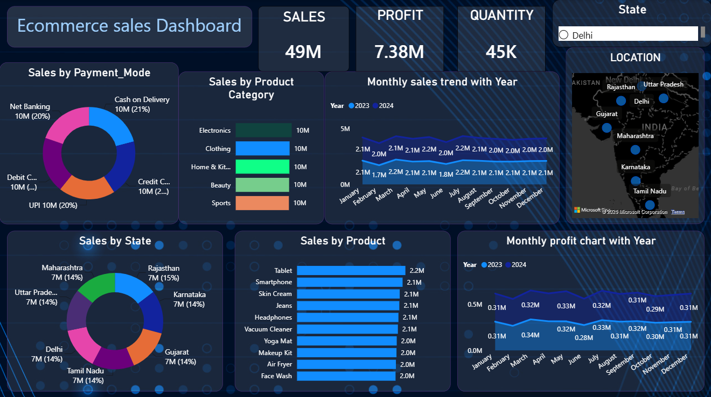

# 🛒 E-Commerce Sales Analysis

<p align="center">
  <b>📊 Data Analytics Project | Excel + Power BI</b><br>
  <i>Turning e-commerce transaction data into actionable business insights</i>
</p>

<p align="center">
  
  
  
</p>

---

## 📌 Project Overview

The **E-Commerce Sales Analysis** project focuses on analyzing an e-commerce sales dataset to understand business performance across **sales, profit, products, categories, customers, payment methods, and geographic locations**.

The project was completed using **Microsoft Excel** for data cleaning, formatting, calculations, and business analysis, followed by **Power BI** for creating an interactive dashboard.

The goal is to transform raw transaction data into clear and meaningful insights that can support better business decisions.

---

## 🎯 Objectives

- Analyze overall e-commerce sales and profitability
- Identify high-performing product categories and products
- Analyze sales performance across states
- Understand customer purchasing patterns
- Identify the most preferred payment method
- Analyze monthly sales trends
- Analyze monthly profit trends
- Build an interactive Power BI dashboard
- Extract actionable business insights from the data

---

## 🛠️ Tools Used

| Tool | Purpose |
|---|---|
| 🟢 **Microsoft Excel** | Data Cleaning, Formatting & Analysis |
| 🟡 **Excel PivotTables** | Business Analysis & Insights |
| 🔵 **Power BI** | Interactive Dashboard & Data Visualization |

---

## 📂 Dataset

The dataset contains the following fields:

1. `Order_ID`
2. `Order_Date`
3. `Customer_ID`
4. `Product_Category`
5. `Product_Name`
6. `State`
7. `City`
8. `Payment_Mode`
9. `Quantity`
10. `Sales_Amount`
11. `Discount`
12. `Profit`

---

# 🧹 Step 1 — Data Cleaning

Data cleaning was performed using **Microsoft Excel**.

### Operations performed:

- Removed duplicate records
- Checked null values
- Checked missing values

This step helped prepare the dataset for reliable analysis.

---

# 🔢 Step 2 — Numerical Data Formatting

The following numerical columns were formatted to **2 decimal places**:

- `Sales_Amount`
- `Discount`
- `Profit`

`Discount` was formatted as a percentage (`%`) for better readability and analysis.

---

# 📊 Step 3 — Data Analysis

Excel was used to calculate the following key metrics:

### 💰 Total Sales
Calculated using the `SUM()` function on `Sales_Amount`.

### 💵 Total Profit
Calculated using the `SUM()` function on `Profit`.

### 🧾 Total Orders
Calculated using the `COUNT()` function on `Quantity`.

### 🏷️ Average Discount
Calculated using the `AVERAGE()` function on `Discount`.

### 📦 Total Quantity Sold
Calculated using the `SUM()` function on `Quantity`.

> Detailed calculations are available in the **Data Analysis** sheet of the Excel workbook.

---

# 📈 Step 4 — Business Analysis

Excel PivotTables were used to identify important business patterns and performance indicators.

### Analysis performed:

- 🌎 **Sales by State**
- 🛍️ **Sales by Product Category**
- 🏆 **Top 10 Products by Sales**
- 💳 **Most Popular Payment Mode**
- 💰 **Profit by Product Category**
- 📅 **Monthly Sales Trend**

---

# 📊 Step 5 — Power BI Dashboard

An interactive **E-Commerce Sales Dashboard** was created in Power BI.

### Dashboard KPIs

- 💰 **Total Sales:** ₹49.38M
- 💵 **Total Profit:** ₹7.38M
- 📦 **Total Quantity:** 45K

### Dashboard Visuals

- Sales by Payment Mode
- Sales by Product Category
- Monthly Sales Trend with Year
- Sales by State
- Sales by Product
- Monthly Profit Trend with Year
- Geographic location visualization

### 🎛️ Slicer

The dashboard includes a slicer for:

- **State**

---

# 🖼️ Dashboard Preview

## Power BI Dashboard

<p align="center">
  
</p>

## Excel Business Analysis


<p align="center">
  
</p>


---

# ❓ Business Questions & Answers

### 1. Which state generates the highest sales?

> **Rajasthan** generates the highest sales.

### 2. Which product category is the most profitable?

> **Electronics** is the most profitable product category.

### 3. Which products generate the highest revenue?

> **Tablet** has generated the highest revenue.

### 4. Which payment method is used the most?

> **Cash on Delivery (COD)** is the most-used payment method.

### 5. What is the monthly sales trend?

> **July** has the highest sales, while **February** has the lowest sales in the analyzed monthly trend.

---

# 💡 Key Business Insights

- 💰 **Total Sales:** ₹49.38M
- 💵 **Total Net Profit:** ₹7.38M
- 📊 **Overall Profit Margin:** ~14.94%
- 📅 **July** has the highest sales at approximately **₹4.35M**
- 📉 **February** has the lowest sales at approximately **₹3.71M**
- 🛒 **Electronics** contributes the most sales at approximately **₹10.23M**
- 💰 **Electronics** also contributes the most profit at approximately **₹1.55M**
- 🏆 **Tablet** and **Smartphone** are the highest revenue-generating products
- 🌎 **Rajasthan** has the highest sales at approximately **₹7.23M**
- 💳 **Cash on Delivery (COD)** is the most preferred payment method, accounting for **3,059 orders**
- 🏷️ **Average Discount:** 15.01%

---

# 📌 Business Takeaways

- **Electronics** should receive continued attention because it leads both sales and profit.
- **Tablet and Smartphone** should be monitored closely because of their strong revenue contribution.
- **Rajasthan** represents a strong-performing geographic market.
- The high preference for **Cash on Delivery** should be considered when planning e-commerce operations.
- Monthly sales variation can help the business plan promotions, inventory, and marketing activities around stronger sales periods.
- Profitability should be considered alongside sales volume when evaluating products and categories.

---

# 📁 Repository Structure

```text
ecommerce-sales-analysis/
│
├── 📄 README.md
│
├── 📊 Project-02.xlsx
│
├── 📈 project-2.pbix
│
├── 📑 Data Analyst Project.docx
│
└── 🖼️ images/
    ├── powerbi-dashboard.png
    └── business-analysis.png
```

---

# 📦 Project Files

### 📊 `Project-02.xlsx`

Contains:

- Dataset
- Data Analysis
- Business Analysis
- PivotTables

### 📈 `project-2.pbix`

Contains the interactive **Power BI E-Commerce Sales Dashboard**.

### 📑 `Data Analyst Project.docx`

Contains the detailed project documentation, methodology, analysis, business questions, answers, and key findings.

---

# 👨‍💻 About Me

## Bhagya Kumar Rajput

🎓 **B.Tech CSE — Data Science**  
📊 **Aspiring Data Scientist**  
🤖 Interested in **Data Analytics, Artificial Intelligence & Machine Learning**

I enjoy working with data to discover meaningful patterns, create visualizations, and turn analytical findings into practical business insights.

---

## ⭐ Thank You

Thank you for taking the time to explore my **E-Commerce Sales Analysis** project.

If you found this project interesting, feel free to ⭐ **star the repository** and explore the analysis and Power BI dashboard.

<p align="center">
  <b>📊 Analyze • Visualize • Discover • Decide 🚀</b>
</p>
